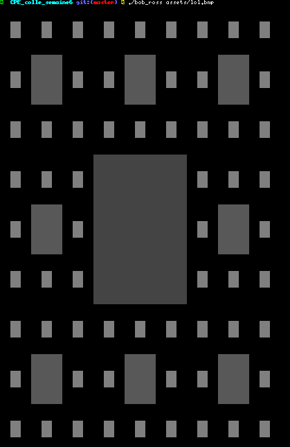

# Elementary programming in C

Deadline : 4 hours

Group size : 2 person

Contributor : peau_c

# Stumper

In assigned groups of two you must create a project within a limited time frame and present it. 

Groups are made up of students from different levels and EVERYONE must be able to explain and demonstrate how the project works. 

If you don't have 15 on the Stumper, you'll come back the following week :)

## Bob ross

This project takes a BMP file as parameter and print it in the terminal, see the screenshots.

## Getting started

These instructions will allow you to obtain a copy of the operational project on your local machine for development and testing purposes.

### Prerequisites

What do you need to install the software and how to install it?

```
gcc
make
```

### Installation

Here's how to start the project on your computer

Clone and go in the directory CPE_colle_semaine5

Project compilation

```
make
```

Running project

```
./bob_ross [file.bmp] 
```


## Screenshot




## Build with

* [C](https://en.wikipedia.org/wiki/C_(programming_language))

## Auteurs

* **David Munoz** - [DavidMunoz-dev](https://github.com/davidmunoz-dev)
